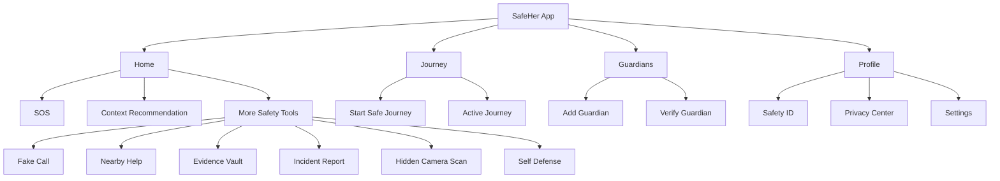

# SafeHer Product Redesign Blueprint

SafeHer should not feel like a list of emergency features. It should feel like a calm protection system that already knows the next best action.

The product strategy is now:

> One unmistakable emergency action, one trusted guardian network, one contextual travel companion.

Everything else is secondary until it supports that promise.

## 1. Product Teardown

### UX Issues

| Issue | Why It Exists | Product Risk | Redesign Decision |
| --- | --- | --- | --- |
| Too many visible features | The app was organized by implementation modules instead of user goals. | A frightened user must decide between tools. | Primary IA becomes Home, Journey, Guardians, Profile. |
| Home sells features | Dashboard logic treated every capability as equally important. | SOS competes with lower urgency tools. | Home becomes a contextual command center with one primary CTA. |
| No single user journey | Features were added independently. | The product has no memory or continuity. | Safe Journey, Guardian readiness and SOS become the central journey. |
| Permission requests lack trust | Permissions are framed as technical needs. | Users may deny critical access or uninstall. | Onboarding explains why each permission matters before requesting. |
| Onboarding is informational | It tells users features exist, but does not configure protection. | Users exit onboarding still unprotected. | Onboarding must verify location, add guardians and rehearse SOS. |

### UI Issues

| Issue | Why It Exists | Product Risk | Redesign Decision |
| --- | --- | --- | --- |
| Dark luxury style is inconsistent | Each screen owns local styling. | Premium impression breaks screen to screen. | Centralize tokens and simplify visual language. |
| Feature cards dominate | Grid density was optimized for demos. | Users scan tools instead of feeling protected. | Secondary tools move behind a collapsed surface. |
| Emergency and non-emergency actions share hierarchy | Visual weight was distributed too evenly. | Cognitive load rises in crisis. | SOS is physically and visually dominant. |
| Copy is feature-first | Labels describe modules, not user outcomes. | The app feels technical. | Copy uses protection language: guardians, protected, journey, alert. |

### Growth Issues

| Issue | Why It Exists | Product Risk | Redesign Decision |
| --- | --- | --- | --- |
| No referral loop | The app treats guardians as internal contacts only. | Growth depends on direct installs. | Guardian invitations become a core loop. |
| No institution story | Product is consumer-only. | Weak distribution for colleges and companies. | Build university, NGO and corporate safety programs. |
| No retention habit | Safety apps are used rarely. | Users uninstall after setup. | Weekly safety check-ins, journey history and guardian reminders. |

### Navigation Issues

| Issue | Why It Exists | Product Risk | Redesign Decision |
| --- | --- | --- | --- |
| Tabs are feature-based | Contacts, Location and Tips were tabs because screens existed. | The navigation does not match user intent. | Tabs become Home, Journey, Guardians, Profile. |
| Important flows are buried | Journey and guardians were secondary despite being core. | Users may never configure protection. | Journey and Guardians become primary tabs. |
| Hidden features are too visible | Tools like hidden camera and incident reports were exposed too early. | Product feels like a toolbox. | Tools remain available, but one level deeper. |

### Trust Issues

| Issue | Why It Exists | Product Risk | Redesign Decision |
| --- | --- | --- | --- |
| Permission trust is assumed | Technical implementation arrived before consent design. | User denies camera, mic, SMS or location. | Permission education and privacy center. |
| Guardian trust is not verified | Contacts can be added without ensuring consent. | SOS may alert someone unprepared. | Guardian verification and invitation flow. |
| Evidence security is vague | Encryption exists but is not explained clearly. | Users may fear sensitive recordings. | Plain-language privacy and encryption explanations. |

### Accessibility Issues

| Issue | Why It Exists | Product Risk | Redesign Decision |
| --- | --- | --- | --- |
| Touch target consistency varies | Components are screen-specific. | Emergency actions may be hard to hit. | Minimum 44x44 targets, SOS far larger. |
| Contrast and state language vary | Local color choices differ. | Poor readability under stress. | WCAG AA token palette and state naming. |
| Screen reader labels are incomplete | Accessibility was added selectively. | Users with assistive tech lose confidence. | Every critical action gets explicit labels. |

### Engineering Issues

| Issue | Why It Exists | Product Risk | Redesign Decision |
| --- | --- | --- | --- |
| JS/TS mix is pragmatic but messy | Migration is partial. | Type safety is uneven. | Convert high-risk flows to TypeScript first. |
| EmergencyContext is too broad | It owns settings, SOS, journeys, sharing, AI and storage. | Hard to test and scale. | Split into services and smaller domain stores. |
| Styling is duplicated | Screens define local tokens. | Inconsistent UI and slower iteration. | Design tokens and reusable components. |
| App naming is inconsistent | Old project identity remains in config and copy. | Trust erosion. | User-facing brand is SafeHer everywhere. |

### Scalability Issues

| Issue | Why It Exists | Product Risk | Redesign Decision |
| --- | --- | --- | --- |
| No guardian platform | Guardians are contacts, not users in a safety network. | Weak network effects. | Guardian invitation and lightweight guardian app/web view. |
| No institutional model | Firebase data is app-centric. | Hard to support campuses or companies. | Add org, zone, alert and membership models. |
| No operational analytics | Events are not designed as product metrics. | Product decisions stay opinion-based. | Add privacy-safe activation and reliability metrics. |

## 2. New Information Architecture

### Site Map

```text
SafeHer
  Home
    Context Card
    SOS
    Protection Status
    Guardian Promise
    Emergency Helplines
    More Safety Tools
  Journey
    Start Safe Journey
    Active Journey
    Journey History
  Guardians
    Primary Guardians
    Backup Guardians
    Guardian Verification
  Profile
    Safety ID
    Privacy Center
    Settings
    Emergency Simulation
  Secondary Tools
    Fake Call
    Nearby Help
    Evidence Vault
    Incident Report
    Hidden Camera Scan
    Self Defense
    Safety Tips
```

### Navigation Tree



### Feature Hierarchy

| Tier | Features | Reason |
| --- | --- | --- |
| Primary | SOS, Safe Journey, Guardians | These create the core promise: help knows where to go. |
| Secondary | Live location, emergency helplines, check-in, profile | They support the primary flow. |
| Hidden | Fake call, hidden camera, evidence vault, incident report, self defense, tips | Useful, but not first-screen decisions. |
| Delayed | Community alerts, AI route prediction, smartwatch, corporate dashboards | Powerful after reliability and trust are proven. |

### User Journeys

#### First Run

```text
Install -> Promise -> Location education -> Add guardian -> SOS rehearsal -> You are now protected -> Home
```

#### Normal Day

```text
Open SafeHer -> Protection status -> Optional Safe Journey -> Close
```

#### Night Travel

```text
Open SafeHer -> Context says after sunset -> Start Safe Journey -> ETA watched -> Arrive -> Guardian confidence increases
```

#### Emergency

```text
Open SafeHer -> Press SOS -> Countdown or hold instant -> Location/evidence/guardian alerts start -> Stop only when safe
```

#### Guardian Setup

```text
Add guardian -> Verify phone -> Guardian receives invitation -> Guardian accepts responsibility -> SafeHer marks verified
```

### Primary Actions

| Screen | Primary Action | Why |
| --- | --- | --- |
| Home | SOS | Emergency actions must require zero learning. |
| Home Context | Start Safe Journey or View Guardians | Context should tell the user the right non-emergency action. |
| Journey | Start Journey / I Arrived Safely | Travel protection is the second strongest use case. |
| Guardians | Add Guardian | Protection depends on reachable humans. |
| Profile | Complete Safety ID | Emergency responders need concise identity info. |

### Secondary Actions

Emergency helplines, fake call, nearby help, incident report, evidence vault, hidden camera scan, self defense, tips, settings.

### Hidden Features

Hidden features are not deleted; they are moved. They belong behind "More Safety Tools" because they are situational and should not compete with SOS.

### Emergency Mode

```text
Screen tone: red, direct, no exploration.
Visible:
  SOS active status
  Delivery status
  Live tracking status
  Evidence status
  Stop SOS
Hidden:
  Tips, settings, non-critical browsing
```

### Normal Mode

```text
Screen tone: calm, dark, steady.
Visible:
  Context recommendation
  SOS
  Guardian/location readiness
  Safe Journey entry point
Hidden:
  Tools and advanced settings
```

## 3. Ideal Onboarding Under 60 Seconds

| Step | Screen | User Feeling | Product Job |
| --- | --- | --- | --- |
| 1 | Promise | "This app knows what to do." | Explain the core system, not features. |
| 2 | Location | "I understand why this matters." | Ask for location with plain-language value. |
| 3 | Guardians | "A real person will know." | Add one trusted person before app entry. |
| 4 | SOS Drill | "I can do this under stress." | Create muscle memory without sending alerts. |
| 5 | Protected | "I am set up." | Close with confidence and clear status. |

Onboarding must not ask for camera, microphone, SMS, background location and notifications all at once. Those should be requested just in time:

| Permission | Request Moment | Reason |
| --- | --- | --- |
| Foreground location | Onboarding | Needed for core SOS and journey. |
| Background location | Starting Safe Journey or enabling Guardian mode | High-trust permission; ask when value is obvious. |
| SMS | SOS setup test or first SOS | Explain offline fallback. |
| Microphone | Enable evidence or sound detection | Sensitive permission; explain storage and trigger. |
| Camera | Evidence capture or hidden camera scan | Not part of first-run trust. |
| Notifications | Guardian reminders and journey alerts | Ask after a benefit is shown. |

## 4. Home Screen Redesign

### Universal Structure

```text
+------------------------------------------------+
| SafeHer                         Settings        |
| Personal safety companion                       |
+------------------------------------------------+
| CONTEXT CARD                                    |
| "You are protected" / "Start Safe Journey"      |
| [One contextual CTA]                            |
+------------------------------------------------+
| Emergency                                      |
|                                                |
|                    SOS                         |
|                                                |
| [Shake SOS] [Evidence] [Live tracking]          |
+------------------------------------------------+
| Guardians       Location       Check-in         |
+------------------------------------------------+
| Guardian promise                               |
+------------------------------------------------+
| Emergency call        Women help                |
+------------------------------------------------+
| More safety tools v                             |
+------------------------------------------------+
```

### Morning

```text
Good morning
SafeHer is ready for your day.
[Start Safe Journey]
```

Why: A morning state should be calm and readiness-based, not alarmist.

### Night

```text
After sunset
Start a Safe Journey before you travel.
[Start Safe Journey]
```

Why: Night changes the recommendation. The product should be proactive without being frightening.

### Travel

```text
Safe Journey active
We are with you until Home.
ETA 10:45 PM. Your guardians can be alerted if you are late.
[I arrived safely]
```

Why: The app becomes a companion and removes repeated decisions.

### Emergency

```text
Emergency mode
Help is being coordinated.
Alerting 2 guardians. Live tracking active. Recording ready.
[Stop SOS]
```

Why: During emergency, every line should confirm action and reduce panic.

### Guardian Active

```text
Guardian active
Your location protection is on.
2 guardians ready.
[View guardians]
```

Why: Users need proof the protection layer is running.

### High-Risk Area

```text
Higher caution area
Keep Safe Journey on until you arrive.
[Start Safe Journey]
```

Why: This should be contextual and evidence-based. Avoid vague fear messages.

### Normal Day

```text
Protected
You are protected.
2 guardians ready. Start a journey when you travel.
[Start Safe Journey]
```

Why: Normal mode should not manufacture urgency.

## 5. Feature Audit

| Feature | Decision | Why |
| --- | --- | --- |
| SOS | Keep and improve | Core product promise. Must be visually dominant and reliable. |
| Guardian Alerts | Keep and rename Guardians | "Contacts" is utility language; guardians create emotional trust. |
| Live Location | Merge into SOS and Journey | Standalone location is less important than why it is shared. |
| Journey Tracking | Keep as primary tab | Strong non-emergency daily use case and retention driver. |
| Fake Call | Hide | Useful escape tool, but not a first-screen action. |
| Calculator Disguise | Hide under stealth mode | Valuable for duress, but should not define the app. |
| Audio Evidence | Merge into SOS and Evidence Vault | Evidence should happen automatically in emergency mode. |
| Emergency Contacts | Merge into Guardians | Same data, better product framing. |
| Nearby Help | Hide | Important but situational; emergency helplines stay visible. |
| Safety Tips | Move/delay | Good retention content, weak emergency value. |
| Hidden Camera Detection | Hide | Useful niche tool; could make product feel gimmicky if prominent. |
| Incident Reporting | Hide | Important after the event, not during the first decision. |
| Self Defense | Move/delay | Education feature, not core flow. |
| Offline SMS | Keep as invisible reliability layer | Users should not have to choose offline mode. |
| Background Tracking | Keep as contextual permission | Ask only when Journey/Guardian mode needs it. |

## 6. Enterprise-Level Design System

### Typography Scale

| Token | Size | Weight | Use |
| --- | --- | --- | --- |
| display | 32 | 900 | Onboarding and major status. |
| title | 24 | 900 | Context card headline. |
| heading | 20 | 900 | Screen-level titles. |
| body | 15 | 500 | Paragraph copy. |
| body-small | 13 | 600 | Support text. |
| caption | 11 | 800 | Labels and metadata. |

Rules: no negative letter spacing; no viewport-scaled type; emergency text uses fewer words and higher weight.

### Spacing System

| Token | Value | Use |
| --- | --- | --- |
| xs | 4 | Icon/text gap. |
| sm | 8 | Internal compact gaps. |
| md | 12 | Row padding. |
| lg | 16 | Card padding. |
| xl | 20 | Screen gutters. |
| 2xl | 24 | Section separation. |
| 3xl | 32 | Onboarding separation. |

### Grid

Mobile grid uses 20px gutters, 10px gaps, one-column content, and three compact status tiles only where scanning is useful.

### Buttons

| Button | Height | Radius | Use |
| --- | --- | --- | --- |
| SOS | 184 | Full circle | Emergency action only. |
| Primary | 56 | 17 | Main CTA. |
| Secondary | 48 | 14 | Lower emphasis. |
| Icon | 42-46 | 14-15 | Settings, add, call. |

### Cards

Cards are for functional surfaces only. Avoid nested cards. Radius 17-22. Border 1px with low alpha. No decorative gradients.

### Inputs

Minimum height 52, 16px horizontal padding, strong focus border, clear labels, no placeholder-only form design.

### Icons

Use Ionicons/lucide-style semantic icons. Icons clarify controls; they do not decorate the product.

### Colors

| Token | Value | Role |
| --- | --- | --- |
| bg | #080A0F | App background. |
| bgElevated | #0E1118 | Tabs and sheets. |
| card | #11151D | Functional surfaces. |
| primary | #E11D48 | Brand and SOS-adjacent action. |
| danger | #E11D48 | Emergency. |
| success | #10B981 | Safe/verified. |
| warning | #F59E0B | Needs attention. |
| info | #6366F1 | Secondary status. |
| text | #F8FAFC | Primary text. |
| textSub | #A7B0BE | Secondary text. |
| textHint | #687386 | Metadata. |

### Corner Radius

| Token | Value |
| --- | --- |
| small | 10 |
| medium | 14 |
| large | 18 |
| xlarge | 22 |
| full | 999 |

### Elevation

Use elevation sparingly. SOS can glow. Core cards use border and background separation, not heavy shadows.

### Animation

| Motion | Use |
| --- | --- |
| SOS pulse | Only on emergency affordance. |
| Button press scale | 0.96-1.0, short duration. |
| Progress transitions | Onboarding and countdown. |
| Avoid | Decorative orbs, constant motion, busy gradients. |

### Dark Mode

Dark mode is the premium default because many safety contexts happen at night. It must be readable outdoors and at low brightness.

### Light Mode

Light mode should use neutral off-white backgrounds, red as a decisive action color, and no pink-heavy palette.

### Accessibility

| Requirement | Standard |
| --- | --- |
| Contrast | WCAG 2.2 AA minimum. |
| Touch targets | 44x44 minimum; SOS far larger. |
| Screen reader | Every emergency action has a direct label. |
| Motion | Critical actions do not depend on animation. |
| Copy | Plain language, no jargon. |

### Component States

Every button and status surface needs default, pressed, disabled, loading, success, warning and danger states.

## 7. Premium Visual Language

SafeHer should feel closer to a serious mobility/health product than a student safety app.

Do:

- Use restrained dark neutrals.
- Let red mean emergency, not decoration.
- Use concise status language.
- Make empty states actionable.
- Keep the app quiet until context requires urgency.

Avoid:

- Pink/purple identity everywhere.
- Feature-grid home screens.
- Hero marketing in the app.
- Decorative blobs and excessive glow.
- Cute copy in emergency states.

## 8. Trust System

### Permission Education

Permission prompts should follow this pattern:

```text
What we need
Why it protects you
When it is used
How to turn it off
[Allow]
```

### Privacy Center

Add a Profile -> Privacy Center screen:

```text
Privacy Center
  Data stored on this device
  Data shared during SOS
  Guardian access
  Evidence encryption
  Delete my data
  Export emergency data
```

### Encryption Explanation

Use human copy:

> Your guardians and evidence are protected on this device. SafeHer only shares emergency data when you trigger SOS, start a journey, or choose to share it.

### Guardian Verification

Guardians should move through states:

```text
Added -> Invited -> Accepted -> Verified -> Active
```

### Emergency Simulation Mode

Simulation should let users rehearse:

- SOS countdown.
- Guardian alert preview.
- Location sharing preview.
- Evidence recording explanation.
- Cancel flow.

No real SMS should be sent in simulation.

## 9. Retention Loops

| Loop | Frequency | User Value | Product Value |
| --- | --- | --- | --- |
| Weekly safety check | Weekly | Keeps guardian list fresh. | Prevents stale setup. |
| Guardian reminder | Monthly | Confirms trusted people are reachable. | Raises reliability. |
| Journey history | After trips | Shows proof of safety habits. | Encourages repeat use. |
| Safety report | Weekly | Summarizes journeys, check-ins, alerts. | Habit formation. |
| Community alerts | Contextual | Warns of verified nearby risks. | Network utility. |
| Achievements | Gentle, not gamified | Reinforces setup completion. | Activation and retention. |
| Smart notifications | Contextual | Suggests journey after sunset/travel. | Timely engagement. |

Avoid streak pressure that could make users feel guilty. Safety is not a game.

## 10. Growth Loops

| Loop | Mechanism | Why It Works |
| --- | --- | --- |
| Guardian invitations | Add guardian sends a clear invite. | Every protected user introduces SafeHer to trusted people. |
| Family onboarding | Guardian gets a lightweight view. | Converts guardians into users. |
| University partnerships | Campus safety dashboards and alerts. | Strong distribution and credibility. |
| NGO partnerships | Safety education and support networks. | Trust in sensitive contexts. |
| Ride-sharing integrations | Share ride and ETA into SafeHer journey. | Matches real travel behavior. |
| Corporate safety | Late-shift and commute protection. | Paid distribution channel. |
| Referral | "Protect someone you care about." | Emotional reason to share. |

## 11. AI Features

AI should come after reliability and trust. Bad AI in safety can be worse than no AI.

| AI Feature | Priority | Design |
| --- | --- | --- |
| Voice SOS | High | Local keyword with confirmation; no cloud dependency for trigger. |
| AI Safety Assistant | Medium | Explains settings, helps plan travel, answers "what should I do?" |
| Unsafe Route Prediction | High later | Uses verified alerts, lighting, time, transport and incident data. |
| Crowd Danger Detection | Medium later | Requires moderation and abuse controls. |
| Context Suggestions | High | "After sunset, start Safe Journey?" |
| Offline AI | Later | On-device intent classification and emergency phrase detection. |

AI rule: never make the user negotiate with AI during an emergency. SOS stays manual and obvious.

## 12. Engineering Architecture Review

### Suggested Folder Structure

```text
src/
  app/
    navigation/
    providers/
  features/
    emergency/
    journey/
    guardians/
    profile/
    privacy/
    evidence/
    tools/
  shared/
    components/
    design-system/
    hooks/
    utils/
  services/
    firebase/
    notifications/
    location/
    storage/
    security/
  types/
```

### State Management

Current EmergencyContext is too broad. Split into:

- EmergencyStore: SOS state and delivery.
- GuardianStore: guardian list and verification.
- JourneyStore: active journey and history.
- PermissionStore: permission education and status.
- SettingsStore: user preferences.

Use React Context for now, but move complex async state to a lightweight store or query layer as the app grows.

### Performance

- Avoid starting background services before user setup is complete.
- Lazy-load secondary screens.
- Memoize derived journey and guardian state.
- Keep SOS screen rendering independent from heavy history lists.

### Caching

- Cache guardian list securely.
- Cache recent location locally for SOS fallback.
- Cache journey history in paginated chunks.

### Error Boundaries

Keep root boundary, add feature-level boundaries for Journey, Evidence and Settings.

### Offline Sync

Queue:

- SOS delivery attempts.
- Journey breadcrumbs.
- Incident reports.
- Guardian verification events.

Critical data should include retry state and user-visible delivery confidence.

### Testing

| Layer | Tests |
| --- | --- |
| Unit | SOS state machine, guardian validation, route ETA logic. |
| Integration | Onboarding completion, SOS simulation, journey start/complete. |
| E2E | First-run to protected, SOS countdown cancel, journey overdue. |
| Manual | Real device SMS, background location, permission denial. |

### CI/CD

- Typecheck on every PR.
- Expo prebuild validation.
- Android internal testing build.
- Firebase rules validation.
- Detox or Maestro smoke tests.

### Security

- Minimize permission requests.
- Keep sensitive storage encrypted.
- Add jailbreak/root warnings without blocking emergency access.
- Add data deletion and export.
- Avoid logging exact locations in production.

### Scalability

Firebase models should prepare for:

- users
- guardians
- guardianInvites
- sosEvents
- journeySessions
- organizations
- zones
- communityAlerts
- evidenceMetadata

## 13. Production Roadmap

### 30 Days

| Work | Impact | Effort | Risk |
| --- | --- | --- | --- |
| Ship new Home, Onboarding, Navigation | Very high | Medium | Medium |
| Normalize brand to SafeHer | High | Low | Low |
| Add emergency simulation mode | High | Medium | Low |
| Add permission education | High | Medium | Medium |
| Add typecheck and smoke tests | High | Medium | Low |

### 60 Days

| Work | Impact | Effort | Risk |
| --- | --- | --- | --- |
| Guardian verification invite | Very high | High | Medium |
| Privacy Center | High | Medium | Low |
| Journey reliability and history | High | Medium | Medium |
| Offline queue visibility | High | Medium | Medium |
| Internal Play Store beta | Very high | Medium | Medium |

### 90 Days

| Work | Impact | Effort | Risk |
| --- | --- | --- | --- |
| Weekly safety report | Medium | Medium | Low |
| Campus alert pilot | High | High | High |
| Voice SOS prototype | High | High | High |
| Analytics and reliability dashboard | High | Medium | Medium |

### 6 Months

| Work | Impact | Effort | Risk |
| --- | --- | --- | --- |
| University partnerships | Very high | High | Medium |
| Guardian web companion | High | High | Medium |
| Unsafe route prediction beta | High | High | High |
| Organization admin dashboard | High | High | High |

### 12 Months

| Work | Impact | Effort | Risk |
| --- | --- | --- | --- |
| Multi-city community safety network | Very high | Very high | High |
| Ride-share integrations | High | Very high | High |
| Corporate safety programs | High | High | Medium |
| Smartwatch integration | Medium | High | Medium |

## 14. Redesign Scores

| Category | Before | Target After Redesign |
| --- | ---: | ---: |
| UX | 6.0 | 8.8 |
| UI | 6.5 | 8.6 |
| Accessibility | 5.8 | 8.4 |
| Security | 7.5 | 8.7 |
| Performance | 7.0 | 8.2 |
| Trust | 5.5 | 8.8 |
| Growth | 4.5 | 8.0 |
| Retention | 4.0 | 7.8 |
| Engineering | 8.0 | 8.8 |
| Innovation | 7.0 | 8.5 |
| Overall Product Score | 6.2 | 8.6 |

## Feature Priority Matrix

| Priority | Feature | Decision |
| --- | --- | --- |
| Critical | SOS | Keep, simplify, harden. |
| Critical | Guardians | Primary tab, verification next. |
| Critical | Safe Journey | Primary tab, improve reliability. |
| Critical | Onboarding | Configure protection, not educate only. |
| High | Privacy Center | Build trust. |
| High | Emergency Simulation | Reduces fear and support burden. |
| High | Permission education | Increases permission acceptance. |
| Medium | Evidence Vault | Keep hidden until needed. |
| Medium | Fake Call | Keep hidden. |
| Medium | Nearby Help | Keep hidden. |
| Delay | AI route prediction | Needs reliable data first. |
| Delay | Community alerts | Needs moderation and partnerships. |

## Go-To-Market Strategy

### Positioning

SafeHer is not a safety toolbox. It is a personal safety companion for women travelling, commuting, studying and working late.

### One-Sentence Differentiation

SafeHer combines SOS, trusted guardians and journey monitoring into one calm flow that knows what to do before the user has to think.

### Launch Channels

| Channel | Strategy |
| --- | --- |
| Campus pilots | Partner with colleges for student safety onboarding. |
| Guardian referrals | Every guardian invite introduces SafeHer to a trusted network. |
| NGOs | Build credibility and education programs. |
| Play Store beta | Use real-user feedback to validate reliability. |
| Social proof | Show reliability metrics, not feature counts. |

### Metrics

| Funnel | Metric |
| --- | --- |
| Activation | Location allowed, guardian added, SOS drill completed. |
| Reliability | SOS delivery confirmed, location accuracy, alert latency. |
| Retention | Weekly active protected users, journeys started, guardian checks. |
| Trust | Permission acceptance, privacy center visits, uninstall rate. |
| Growth | Guardian invites sent, guardian accept rate, referrals. |

## Launch Checklist

### Product

- [ ] Home screen has one contextual primary CTA.
- [ ] SOS is visible and testable.
- [ ] Onboarding finishes with "You are now protected."
- [ ] Guardians are configured before full trust claim.
- [ ] Secondary tools are discoverable but not distracting.

### Trust

- [ ] Permission education exists before sensitive prompts.
- [ ] Privacy Center explains storage and sharing.
- [ ] Guardian verification is designed.
- [ ] Emergency simulation does not send real alerts.
- [ ] Data deletion is available.

### Engineering

- [ ] Typecheck passes.
- [ ] Firebase rules validated.
- [ ] Real-device SMS tested.
- [ ] Background location tested.
- [ ] Crash reporting enabled.
- [ ] No sensitive logs in production.

### Accessibility

- [ ] SOS has clear screen reader label.
- [ ] All touch targets are at least 44x44.
- [ ] Text contrast meets WCAG 2.2 AA.
- [ ] Motion is not required to understand state.
- [ ] Error states are plain-language and actionable.

### Store Readiness

- [ ] Screenshots show the actual product.
- [ ] Permission copy uses SafeHer consistently.
- [ ] Disclaimer is clear.
- [ ] Internal testing group validates emergency flows.
- [ ] Support and feedback channel exists.

## Final Verdict

SafeHer's engineering ambition is strong. The product weakness was not missing features; it was too many visible choices. The redesigned product now has a clearer spine:

```text
Protected at rest.
Watched while travelling.
Help coordinated during emergencies.
```

That is the product worth building.
